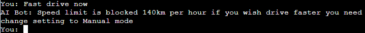

𝔸𝕦𝕥𝕠𝕟𝕠𝕞𝕠𝕦𝕤 𝕍𝕖𝕙𝕚𝕔𝕝𝕖 𝔹𝕠𝕥 𝔸𝕀
project

# Introduction

Project milestone 3 for Code Institute Full-stack development program: Python Terminal.
Autonomous Vehicle Bot AI is a Python terminal bot, which runs in the Code Institute mock terminal on Heroku. The main goal of Autonomous Vehicle BOT AI is to recognise command and response quickly  in order to drive with comfort and efficiency plus with the word that the computer randomly selects. This project was inspired by The Fifth Element science fiction action film.

[Live Project Here](https://ai-auto.herokuapp.com/)

## User Experience - UX

### User Stories

* As an AI bot creator, I want to:
  
1. Build an easy app for the users to chat the bot.
2. Build an AI bot that is both enjoyable and challenging for the users.
   
* As a new autonomous vehicle bot AI owner, I want to:

1. Be able to understand the purpose of the AI chat and start drive a vechicle.
2. Be able to follow routine interacting daily with the vechicle, see the right letters appear once used right words.
3. Be able to drive and stop the car and immediatly keep moving forward if it is necessary.

### Flowcharts 
 
I spent time planning and thinking about the logic and flow behind the AI bot to ensure I had a general idea of how it could be built. I created flowcharts to assist with the logical flow. The charts were generated using [Lucidchart](https://lucid.app/) Integration and are shown below. 

## Features

### Logo and Intro Message

)
)

* When the users reach the website, they will see this feature. The Autonomous Vehicle Bot AI logo and the intro message is displayed here.

### Greeting message

)

* When the user uses greetings AI bot respond 

### Anything

)

* When the users ask anything AI bot respond

### Seat belt

)

* When the users fastening seat belt AI bot respond

### Lights on

)

* When the users lights on AI bot respond

### Music On

)

* When the users play music AI bot respond

### Navigation

)

* When the users trying to find location AI bot respond

### Auto-pilot

)

* When the users want drive hand free AI bot respond

### Fast drive

)

* When the users like speed racing AI bot respond

### Manual

)

* When the users decide drive themselves AI bot respond and allows them 

### Stop

)

* When the users want to brake AI bot respond and stops

## Creating the Heroku app

When you create the app, you will need to add two buildpacks from the _Settings_ tab. The ordering is as follows:

1. `heroku/python`
2. `heroku/nodejs`

You must then create a _Config Var_ called `PORT`. Set this to `8000`

Connect your GitHub repository and deploy as normal.

#### Python Packages

* [Random](https://docs.python.org/3/library/random.html?highlight=random#module-random): returns a random integer to get a random word

### Frameworks - Libraries - Programs Used

* [Git](https://git-scm.com/)
    * Git was used for version control by utilizing the Gitpod terminal to commit to Git and push to GitHub
* [GitHub](https://github.com/)
    * GitHub is used to store the project's code after being pushed from Git
* [Heroku](https://id.heroku.com)
    * Heroku was used to deploy the live project

* [Lucidchart](https://lucid.app/)
    * Lucidchart was used to create the flowchart
* [PEP8](http://pep8online.com/)
    * The PEP8 was used to validate all the Python code

## Testing

  ## Functionality 
* The terminal has no issues and is working properly 
* The typewriter starts typing at the right time and is working correctly 
* The input has right behaviour and shows the user an random rephrase if the input is not correct
* The AI bot responds without any issues after the owner of bot submits their requests
* The AI bot runs without any issues and as expected 
* All the options are working without any fails

## Bugs 
Not one left.Bugs free AI 

## Deploying this Project

* This site was deployed by completing the following steps:

1. Log in to [Heroku](https://id.heroku.com) or create an account
2. On the main page click the button labelled New in the top right corner and from the drop-down menu select Create New App
3. You must enter a unique app name
4. Next select your region
5. Click on the Create App button
6. The next page is the project’s Deploy Tab. Click on the Settings Tab and scroll down to Config Vars
7. Click Reveal Config Vars and enter port into the Key box and 8000 into the Value box and click the Add button
8. Click Reveal Config Vars again and enter CREDS into the Key box and the Google credentials into the Value box
9. Next, scroll down to the Buildpack section click Add Buildpack select python and click Save Changes
10. Repeat step 8 to add node.js. o Note: The Buildpacks must be in the correct order. If not click and drag them to move into the correct order
11. Scroll to the top of the page and choose the Deploy tab
12. Select Github as the deployment method
13. Confirm you want to connect to GitHub
14. Search for the repository name and click the connect button
15. Scroll to the bottom of the deploy page and select the preferred deployment type
16. Click either Enable Automatic Deploys for automatic deployment when you push updates to Github

## Forking This Project

* Fork this project by following the steps:

1. Open [GitHub](https://github.com/)
2. Click on the project to be forked
3. Find the Fork button at the top right of the page
4. Once you click the button the fork will be in your repository